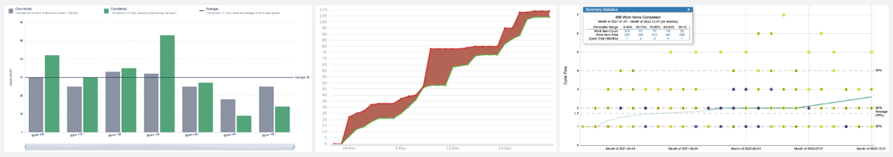

# An important factor teams miss in agile maturity quest

Here is a short quiz. Which of the team below is best equipped to drive continuous improvements in its ways of working?

- Team A measures its velocity (# of stories/SP completed) as a measure of its current performance and improvement.
- Team B has decided to measure Defect density per release to ensure their quality. Lower the defect rate, better the
  team’s work quality.
- Team C measures Cycle time for each unit of work from start to end. And improving this cycle time is their measure of
  improvement.

In my own experience, I have seen majority of teams follow Team A’s approach. Some others who use a combination of Team
A and Team B approach, and very few who take Team C’s approach.
So, which approach is the best? Well, none in particular.
On the contrary, all the above approaches, when applied individually, can be misleading and in some cases
counter-productive.

**Velocity**, for instance, is an indicator of team’s capacity and influenced by multiple factors, some beyond team’s
control. While it’s useful for team’s own planning, using it as a measure of team’s maturity and performance is a
wild-goose chase. If you insist on measuring it, you may soon realise that team’s velocity may have consistently
stabilised, but underlying business value hasn’t.

> *Tell me how you will measure me, and then I will tell you how I will behave* - *Eliyahu Goldratt*

**Defect density** indicates the number of defects for a period of development. If we scope it by release, we measure it
by # of defects per release. The measure can certainly help to focus on quality. Though when not complemented with good
engineering practices of automated testing, pair programming and reviews, such measures tend to drag development,
testing and review cycles, impacting team’s ability to deliver quickly.

**Cycle time** is a useful measure to understand the time it takes to get something done. When complemented with **
Throughput** (units of work completed for a given period), it can provide good insights into team’s effectiveness. But
wait, what exactly is **done** here? I have seen the interpretation of **done** varies from team to team. For example

- Some teams measure cycle time from time development starts to UAT completed.
- Some function driven teams measure cycle time from the start to end of their function (Eg. A front-end component based
  team marks its work done when they have delivered an interactive UI, not accounting for end to end functionality,
  which might be a part of a large system).

It gets complicated, when a team’s **done** is not necessarily business’s done. Or even worse, when inter-dependent
teams have different interpretations of what **done** is. A lack of shared understanding of what **done** means leads to
confusion and ambiguity in understanding team’s real progress.

All the measurements above are meaningless unless we know what **done** means?

And, that’s why Definition of Done(DoD) is a crucial factor to guide team’s agility. The Scrum guide 2022 defines DoD as
below

> *The Definition of Done is a formal description of the state of the Increment when it meets the quality measures
required for the product -Scrum guide*

It’s important to understand that quality in quote above is not limited to code quality, but a reference to product
increment quality. Which means, it covers both internal(visible to development like testability, maintainability of
code) and external(visible to customers like usability, correctness and reliability) quality characteristics of the
product.

In that aspect, DoD is the measure of quality for team’s efforts and should be able to answer the following questions

- What are our quality goals?
- What it takes to bring a quality product to customer?
- How do I ensure that every increment I create meets the agreed quality standard of team?
- How do we communicate about our quality to stakeholders?

A word of caution though. Don’t let DoD become a mere documented checklist of things. The funny thing about the document
trap is that often its not read, and even when read, its not necessarily interpreted the same way by all its readers.

A DoD is meant to be a shared understanding that needs to be developed, and diligently practised by the team. At times
tacit, its a work practice that passed and refined within the team.

You might wonder, but, how does a DoD influence team’s maturity?

The DoD is a reflection of team’s current capabilities to generate business value with quality as a pre-requisite.

A team’s maturity is reflected in the way it extends its quality goals while ensuring a sustainable pace of delivering
business value. A team should continuously assess and extend its quality goals, and identify it as DoD to let it guide
the improvement path.

As product grows, additional dimensions of quality emerge, like security, performance, robustness, and usability. And
DoD should be updated to respond to these emerging quality concerns of the product.

Here is a short example to illustrate.

| **Today**                                      | **After 3 months**                             | **After a year**                               | **Beyond** |
|:-----------------------------------------------|:-----------------------------------------------|:-----------------------------------------------|:-----------|
| &check; All acceptance tests passed            | &check; All acceptance tests passed            | &check; All acceptance tests passed            | ....       |          |
| &check; Code peer reviewed / pair programmed   | &check; Code peer reviewed / pair programmed   | &check; Code peer reviewed / pair programmed   |            |
| &check; Tested in Production clone environment | &check; Security tests passed                  | &check; Security tests passed                  ||
| &check; Functionality reviewed by business/PO  | &check; Tested in Production clone environment | &check; Tested in Production clone environment || 
|                                                | &check; Functionality reviewed by business/PO  | &check; Functionality reviewed by business/PO  ||
|                                                | &check; Documentation updated (as applicable)  | &check;Documentation updated (as applicable)   ||
|                                                |                                                | &check; Deployed in Production                 | 
|                                                |                                                | &check; Post deployment verification completed |            |

The DoD is a living standard that guides team towards maturity. And a well understood and well practised DoD makes your
measurements more authentic.